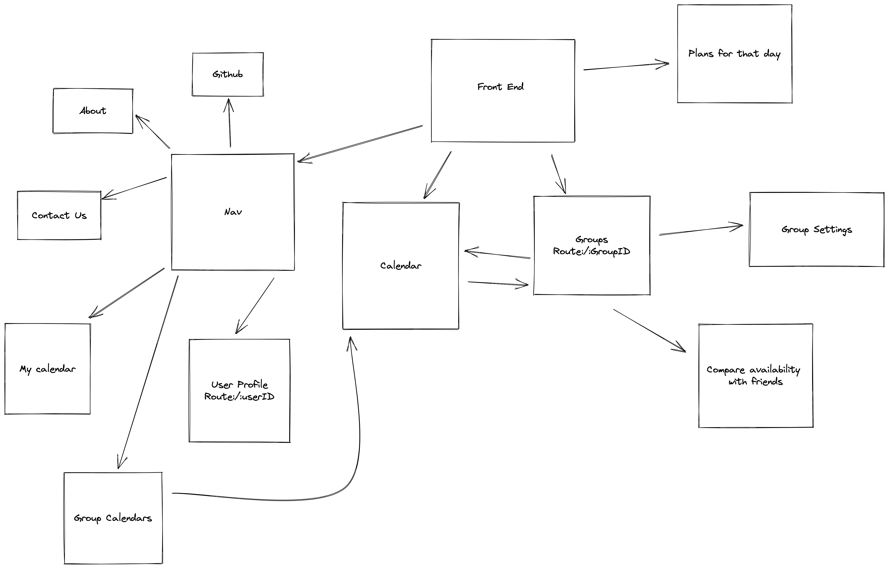
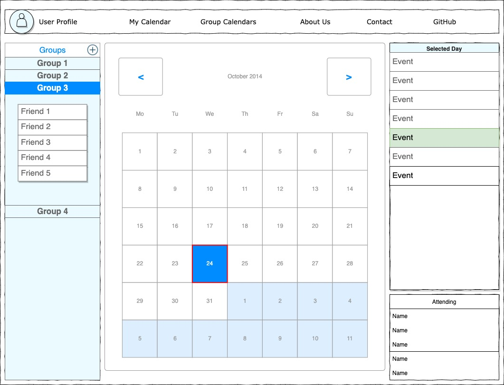

Grouper App

	Our idea for an application is a social media application in which users can input their schedule into a calendar.  The users can then join groups with their friends and the application will compare everyone’s schedules to show when the group can hang out.

Technologies that were used:  
    React - https://reactjs.org/ 
    React-Router - https://v5.reactrouter.com/web/guides/quick-start 
    React-Strap - https://reactstrap.github.io/?path=/story/home-installation--page 