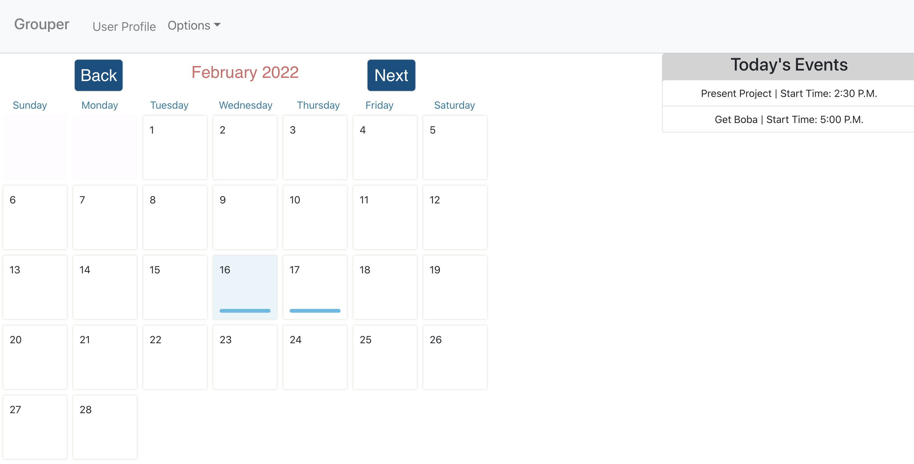

## Grouper App

The application is a personal calendar app where users can keep track of their schedules by inputting events.  Each user is able to create an account and where all of their events will be saved for later reference.  
 
<h3><a href="https://github.com/saifalushi1/grouper-backEnd">BackEnd Code:</a></h3>
 
<h3><a href="https://youtu.be/NaOKbcd9hVQ">Demo:</a></h3>
  

  

### Stretch Goals:

<ul>
    <li>Incorporate the ability to join groups with your friends</li>
    <li>In the groups section have a shared calendar where all members events are shown</li>
    <li>Add ability to add group events that will show on every member's personal calendar</li>
    <li>Additional styling</li>
</ul>
 

### Technologies that were used:  

 
    React - https://reactjs.org/ 
     
    React-Router - https://v5.reactrouter.com/web/guides/quick-start 
     
    React-Strap - https://reactstrap.github.io/?path=/story/home-installation--page 
     
    Site deployed using Heroku - https://www.heroku.com
  
The initial idea for an application is a social media application in which users can input their schedule into a calendar.  The users can then join groups with their friends and the application will compare everyone’s schedules to show when the group can hang out.  Due to some unforseen circumstances involving our group size being reduced to two people, we had to change directions a bit.  
  

### The initial frontend and backend mockups

 

